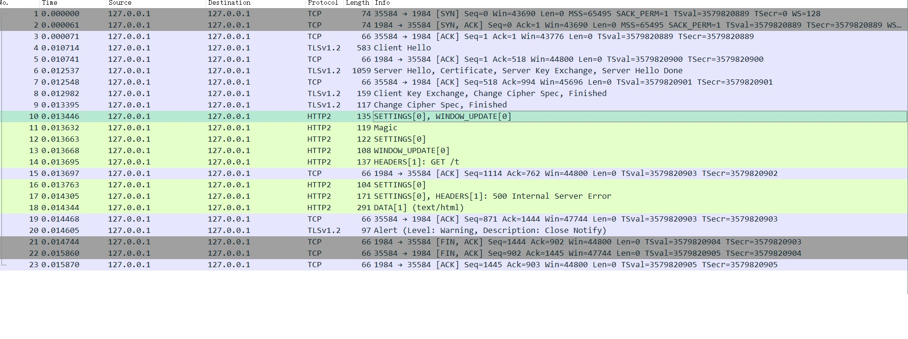

# http2连接初始化

``` shell
#0  ngx_http_v2_state_preface (h2c=0x15a9310, pos=0x164b0b0 "PRI * HTTP/2.0\r\n\r\nSM\r\n\r\n", end=0x164b11e "")
    at src/http/v2/ngx_http_v2.c:713
#1  0x00000000004bca20 in ngx_http_v2_read_handler (rev=0x16141f0) at src/http/v2/ngx_http_v2.c:415
#2  0x00000000004bcf8a in ngx_http_v2_init (rev=0x16141f0) at src/http/v2/ngx_http_v2.c:328
#3  0x0000000000490a13 in ngx_http_ssl_handshake_handler (c=0x15da400) at src/http/ngx_http_request.c:821
#4  0x000000000047de24 in ngx_ssl_handshake_handler (ev=0x16141f0) at src/event/ngx_event_openssl.c:1390
#5  0x0000000000479637 in ngx_epoll_process_events (cycle=0x1597e30, timer=<optimized out>, flags=<optimized out>)
    at src/event/modules/ngx_epoll_module.c:902
#6  0x000000000046f9db in ngx_process_events_and_timers (cycle=0x1597e30) at src/event/ngx_event.c:242
#7  0x000000000047761c in ngx_worker_process_cycle (cycle=0x1597e30, data=<optimized out>) at src/os/unix/ngx_process_cycle.c:750
#8  0x0000000000475c50 in ngx_spawn_process (cycle=0x1597e30, proc=0x477589 <ngx_worker_process_cycle>, data=0x0,
    name=0x684922 "worker process", respawn=-3) at src/os/unix/ngx_process.c:199
#9  0x00000000004769aa in ngx_start_worker_processes (cycle=0x1597e30, n=1, type=-3) at src/os/unix/ngx_process_cycle.c:359
#10 0x0000000000477cb0 in ngx_master_process_cycle (cycle=0x1597e30) at src/os/unix/ngx_process_cycle.c:131
#11 0x0000000000450ea4 in main (argc=<optimized out>, argv=<optimized out>) at src/core/nginx.c:382
```


# wireshark分析

## 编译sslkeylog

``` shell
cc sslkeylog.c -shared -o libsslkeylog.so -fPIC -ldl
sudo cp libsslkeylog.so /usr/local/lib/libsslkeylog.so
```

## 配置nginx

注意两个env的配置

``` shell
worker_processes  1;
daemon on;
master_process off;
error_log /home/ljl/code/orinc/lua-nginx-module-plus/servroot/logs/error.log debug;
pid       /home/ljl/code/orinc/lua-nginx-module-plus/servroot/logs/nginx.pid;

env LD_PRELOAD=/usr/local/lib/libsslkeylog.so;
env SSLKEYLOGFILE=/tmp/premaster.txt;


events {
    accept_mutex off;
    worker_connections  64;
}

http {
    access_log /home/ljl/code/orinc/lua-nginx-module-plus/servroot/logs/access.log;

    default_type text/plain;
    keepalive_timeout  68;

    server {

        listen          1984 ssl http2;
        server_name     'localhost';

        ssl_certificate     ../../t/cert/test.crt;
        ssl_certificate_key ../../t/cert/test.key;

        client_max_body_size 30M;

        location /t {
            content_by_lua '
                local sock, err = ngx.req.socket()
                if sock then
                    ngx.say("got the request socket")
                else
                    ngx.say("failed to get the request socket: ", err)
                end

                for i = 1, 3 do
                    local data, err, part = sock:receive(5)
                    if data then
                        ngx.say("received: ", data)
                    else
                        ngx.say("failed to receive: ", err, " [", part, "]")
                    end
                end
            ';
        }

        # End test case config.

        location / {
            root /home/ljl/code/orinc/lua-nginx-module-plus/t/servroot/html;
            index index.html index.htm;
        }
    }
}
```

## 启动nginx

``` shell
LD_PRELOAD=/usr/local/lib/libsslkeylog.so  SSLKEYLOGFILE=/tmp/premaster.txt nginx -p servroot/
```

## 启动抓包

``` shell
sudo tcpdump -i lo tcp port 1984 -w h2.pcap 
```

## http 请求

发送请求后停止抓包

``` shell
curl -kvs --http2 https://127.0.0.1:1984/t
```

## wireshark 配置

Edit-> Preferences -> Protocols -> TLS

在(Pre)-Master-Secret log filename中选择上面配置的premaster.txt文件.

**具体的数据包可以查看 data/h2**

